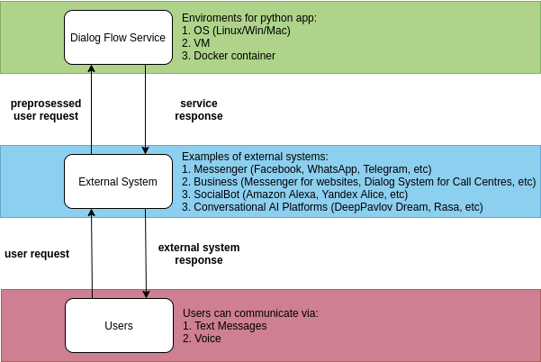
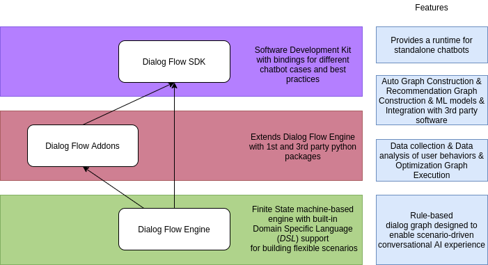
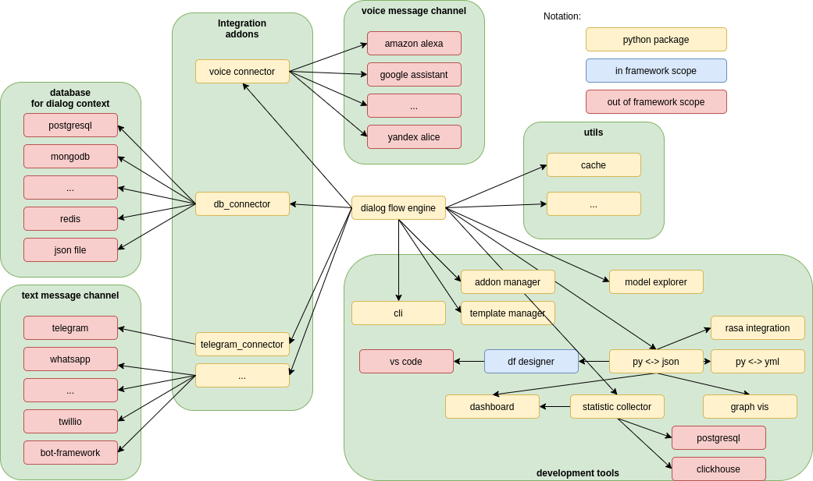

# Introduction
[](https://github.com/deepmipt/dialog_flow_engine/blob/master/LICENSE)


This repository can help to navigate DeepPavlov Dialog Flow Framework projects. Dialog Flow Framework is a free and open-source python software stack for creating chatbots, released under the terms of Apache License 2.0.



Using the framework, you can quickly create your own solution for dialog systems.

# Contents
- [Introduction](#introduction)
- [Contents](#contents)
- [Dialog Flow Stack](#dialog-flow-stack)
  - [## Overview](#-overview)
  - [## Dialog Flow Engine (stable)](#-dialog-flow-engine-stable)
  - [## Dialog Flow Addon System](#-dialog-flow-addon-system)
  - [## Dialog Flow SDK](#-dialog-flow-sdk)
- [FAQ](#faq)

# Dialog Flow Stack
## Overview
---
Dialog Flow Framework is open-source python software stack:
- Dialog Flow Engine (To write flexible scripting dialogue in a short time using an expressive DSL in Python)
- Dialog Flow Addon System (To extend Dialog Flow Engine)
- Dialog Flow SDK (Tool set for Dialog Flow Framework)




## Dialog Flow Engine (stable)
---

Dialog Flow Engine (DFE) allows you to write conversational services. The service is written by defining a special dialog graph that describes the behavior of the dialog service. The dialog graph contains the dialog script. DFE offers a specialized language (DSL) for quickly writing dialog graphs. You can use it in such services for writing skills for Amazon Alexa and etc, chat-bots for social networks, websites call-centers and etc. Link to the repository is available [here](https://github.com/deepmipt/dialog_flow_engine)


[](https://readthedocs.org/projects/dialog-flow-engine/badge/?version=latest)
[](https://github.com/deepmipt/dialog_flow_engine/actions)
[](https://github.com/deepmipt/dialog_flow_engine/actions)
[](https://github.com/deepmipt/dialog_flow_engine/blob/master/LICENSE)

[](https://pypi.org/project/df_engine/)
[](https://pepy.tech/project/df_engine)


## Dialog Flow Addon System

---
Python packages for Dialog Flow Engine Extending:
- [dialog_flow_db_connector](https://github.com/deepmipt/dialog_flow_db_connector) (stable) - Contexts saver into json/pickle/postgres/mysql
- [dialog_flow_generics](https://github.com/deepmipt/dialog_flow_generics) (stable) - Dialog Flow Generics introduces a GenericResponse class as well as generic classes for various media types. 
- [dialog_flow_examples](https://github.com/deepmipt/dialog_flow_examples) (stable) - Data collection & Data analysis of user behaviors
- [dff-node-stats](https://github.com/kudep/dff-node-stats) (unstable) - Data collection & Data analysis of user behaviors
- [df-addon-turn-caching](https://github.com/kudep/df_addon_turn_caching) (unstable) - Turn Caching
- df-addon-tg-connector (planned) - Telegram connector for connecting to Telegram Messenger 
https://github.com/deepmipt/dialog_flow_db_connector

## Dialog Flow SDK
---
Tool set for Dialogflow Framework, link to the repository is available [here](https://github.com/deepmipt/dialog_flow_sdk)


# FAQ

- What's the difference between **Google DialogFlow** and **Dialog Flow Framework**? 

```
Dialog Flow Framework or in other words DeepPavlov Dialog Flow Framework is an open source framework for quickly writing dialog services. Google Dialogflow  is a closed proprietary product of Google. These products are not related in any way, except for a similar name.
```


asynchronous
error tolerant
flexible
load monitoring
